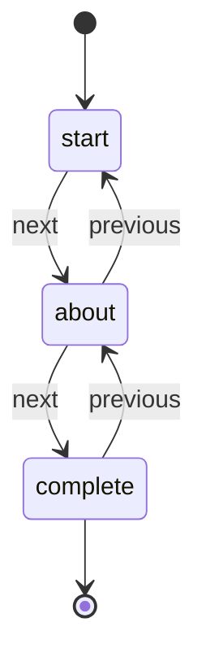
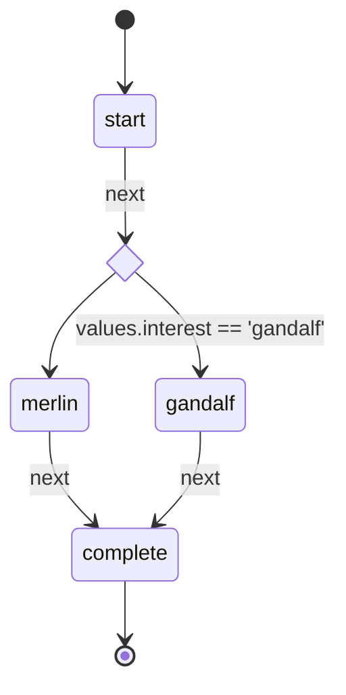

# Becoming a Form Wizard

Intuitive Multi-Step Workflows w/ State Machines

---
layout: cover
---

# The bit about me

- Nick Hehr
- Staff Software Engineer, Front End Platform Team @Betterment
- Empathetic Community Organizer
- Amateur Embedded JS Developer
- Outdoor cyclist, Indoor climber

---
layout: table-contents
---

# Our journey

- What is a wizard?
- How are they typically created?
- Where do state machines come in?
- What can we use today?
- What lies ahead?

---
layout: new-section
sectionImage: "/ms_wizard_setup.png"
---

# What is a wizard?

<!--
Requesting user input to create records or perform actions is not always as simple as a form on a single page. Many user experiences require customers to click through multiple steps to submit all the information needed to complete a complex task.

This UI pattern is often called a “wizard”, a term dating back to the late 80s and early 90s, to indicate “step-by-step guides that are designed to walk you through complex tasks.” A popular source of this phraseology is Microsoft Publisher’s Page Wizard feature and the Connection Wizard.
-->

---
layout: image-center
image: "/gandalf-adventure.gif"
imageWidth: '800'
---

<!-- Looking for someone to share in an adventure -->

<!--
While this brings the Lord of the Rings and Gandalf the Grey to mind, others might picture the Microsoft Windows Connection Wizard or Turbo Tax for a modern take.
-->


---
layout: image-center
image: "/macos_setup_assistant.jpg"
imageWidth: '600'
---

<!-- gif or screenshots of user onboarding / TurboTax -->

<!--
Many services and apps will break up their registration process into a series of steps to ease that process, especially if there is quite a bit of information to gather in order to get started. Filling out long forms can be incredibly tedious, so wizards provide an experience where people can focus on individual pieces of those long forms with a sense of accomplishment with each step forward. Based on choices made through the process, the wizard can even help people skip irrelevant paths and potential confusion. I think we've all seen those sections on tax forms that have a bunch of fine-print conditionals that eventually lead to ignoring it altogether. 
-->

---
layout: image-left
image: "/long_form_example.png"
---

## What we don't want

<v-clicks>

- overwhelming
- distracting
- tedious

</v-clicks>

---
layout: image-center
image: "/simple_signup.gif"
imageWidth: '600'
---

<!-- Go with the flow, my dude -->

<!--
At Betterment, we call this pattern a "flow" (or workflow) and use it a lot! As a financial services company, there's a lot of information and complex concepts to cover, and we want to ensure our clients understand these decisions. Along with the usual sign up task, we've formalized creating goals, moving money, connecting external accounts, and more as flows. Given how many we've had to build and maintain, it makes sense to have some common conventions and utilities for teams to use.
-->

---
layout: new-section
sectionImage: "/hammer-and-wrench.png"
---

# How are these experiences typically built?

---
layout: image
image: /react-multi-step-form-DuckDuckGo.png
---

<!--
If you've ever had to tackle this pattern in the past, you might have searched for "multi-step forms" or "form wizard for X" where X is the framework of choice for your product. I know I definitely looked around for such a solution when starting this journey at Betterment. 
-->

<!--
If you've ever had to tackle this pattern in the past, you might have searched for "multi-step forms" or "form wizard for X" where X is the framework of choice for your product. I know I definitely looked around for such a solution when starting this journey at Betterment
-->

---
layout: image
image: /formik-og.png
---

<!--
Naturally, I looked to the docs and examples for Formik (the form state manager of choice at Betterment).
-->

<!--
Naturally, I looked to the docs and examples for Formik (the form state manager of choice at Betterment).
-->

---
src: ./formik-multi-step-code.md
---

<!--
Looking to the Formik repo, we can find an example for a [`MultipstepWizard`](https://github.com/jaredpalmer/formik/blob/master/examples/MultistepWizard.js) that creates an abstract `Wizard` component with `WizardStep` child components. This allows for nice composition while splitting up a large form, and it could be reused across features as long as they use the same layout. One notable downside is the lack of routing, so the current step of the flow is lost if the page is reloaded.
-->

---
src: ./routed-multi-step-code-1.md
---

<!--
In the same repo, we can find two examples of routed multi step forms, one using [numbered steps](https://github.com/jaredpalmer/formik/blob/master/examples/RoutedMultistepWizard.js) and the other using [named steps](https://github.com/jaredpalmer/formik/blob/master/examples/RoutedMultistepWizard2.js). The numbered steps provides a similar composition benefit as the first example, although numbers are not too helpful as path names to communicate the intent of the step. With the named steps, the ability to customize validation and form submission per step is lost. 
-->

---
src: ./routed-multi-step-code-2.md
---

<!--
The greatest weakness of each of the examples is how tied they are to Formik, which ultimately makes sense as example for this library. However, many approaches found online will promote similar patterns especially with route-less steps. They are all generally focused on moving sequentially, a.k.a linear progression. It's not easy to see how conditionally paths could be integrated.

Looking at the purpose-built libraries, nothing appeared to solve all the concerns of building flows at Betterment. So that's when I set out to solve it myself.
-->

---

## Primary Directives

1. Flows will be routed, meaning visible steps should match a path in the URL
2. Navigation among steps should have a single source of truth
3. Flows are form-agnostic, however they can integrate cleanly with Formik as the preferred form library

<!--
To direct the work towards building this new solution, I came up with 3 primary directives.

The first maintains the stance that good web experiences have URLs and aligned with the existing Rails-driven flows.

The second was a learning from the Rails-driven flows that made it complex to maintain our flows.

The last one came from looking at our needs at Betterment and how wizards may gather information but it is not required.
-->

---
layout: cover
---

## Dream API

```tsx
 <Wizard>
   <Step name="first-name" component={FirstNameStep} />
   <Step name="last-name" component={LastNameStep} />
   <Step name="success" component={SuccessStep} />
 </Wizard>
```

<!--
We're going to implement this initial API together to demonstrate the core idea.
-->

---
layout: cover-logos
logos: [
  "/reactjs.svg",
  "/react-router.png"
]
---

## Supplies

- React Context
- `useReducer` hook
- React-Router Route components
- custom hook

<!-- 
react-router Route components, React Context, useReducer, custom hook

If you're not familiar with React and React Router, I'll do my best to give a brief description of the concepts.
-->

---

## React Context

```tsx
const WizardContext = createContext(undefined);
```

<!--
We'll start with a React Context object from createContext. This is an object primarily made up of two React components to enable sharing state without manually passing it through props. 
-->

---

## Provide some context

```tsx {2-5|6|7-11|12-19|all}
function Wizard({ children, initialValues }) {
  const steps = React.Children.map(children, (result, child) => {
    if (child?.type === Step) return child.props.name;
    return false;
  }).filter(Boolean);
  const defaultStep = steps[0];
  const value = useReducer(wizardReducer, {
    currentStep: defaultStep,
    values: initialValues,
    steps
  });

  return (
    <WizardContext.Provider value={value}>
      {children}
      <Switch>
        <Redirect from="/" to={defaultStep} exact />
      </Switch>
    </WizardContext.Provider>
  );
}
```

<style>
.slidev-layout {
    overflow: scroll;
  }
</style>

<!--
Here is our basic Provider, where we iterate over the Step components to get their `name` prop in the order in which they are declared.

Then our context value is the result from the `useReducer` hook that has been created with some initial state of the first step in the flow, the initialValues prop, and all the steps found in the `children`.

We include a Redirect to the first step in the flow, so any link to this feature doesn't need to know about the first step.
-->

---

## Reducer function

```tsx {3-4|5-12|all}
const wizardReducer = (state, action) => {
  switch (action.type) {
    case 'sync':
      return {...state, currentStep: action.step };
    case 'updateValues':
      return {
        ...state,
        values: {
          ...state.values,
          ...action.values,
        },
      };
    default:
      return state;
  }
};
```

<!--
The `sync` action is used to keep the current step in sync with the URL. And the `updateValues` action is fairly straightforward, merging the current values in state with new ones provided by the action. 
-->

---

## React-Router Route components as steps

```tsx
function Step ({ component: Component, name }) {
  const state = useWizardContext();
  return <Route path={name} render={() => <Component {...state} />} />;
}
```

<!--
The Step component ends up being a very light layer over the Route component, providing access to the shared flow context through the `useWizardContext` hook, which we'll cover shortly. The usage should be familiar to anyone who has used react-router in the past.

While step components and others under the Wizard provider can access the `useWizardContext` hook directly, this allows step components to save some boilerplate.

It all comes together in the custom hook.
-->


---

## Custom hook

```tsx {2|5-10|11-17|19-27|28-35|36-43|all}
function useWizardContext() {
  const [wizardState, dispatch] = useContext(WizardContext);
  const history = useHistory();

  const sync = useCallback(
    (step) => {
      dispatch({ type: 'sync', step });
    },
    [dispatch]
  );

  const updateValues = useCallback(
    (values>) => {
      dispatch({ type: 'updateValues', values });
    },
    [dispatch]
  );

  const goToStep = useCallback(
    (step, values) => {
      if (values) updateValues(values);
      sync(step);
      history.push(step);
    },
    [flowState.steps, history.push, updateValues, sync]
  );

  const goToNextStep = useCallback(
    (values) => {
      const nextStep = getNextStep(wizardState.steps, wizardState.currentStep);
      if (nextStep) goToStep(nextStep, values);
    },
    [wizardState.steps, wizardState.currentStep, goToStep]
  );

  const goToPreviousStep = useCallback(() => {
    const previousStep = getPreviousStep(
      wizardState.steps,
      wizardState.currentStep
    );
    if (previousStep) goToStep(previousStep);
  }, [wizardState.steps, wizardState.currentStep, goToStep]);

  return {
    wizardState,
    sync,
    updateValues,
    goToStep,
    goToNextStep,
    goToPreviousStep
  };
}
```

<style>
.slidev-layout {
    overflow: scroll;
  }
</style>

<!--
The hook accesses the wizard context and contained state + dispatch function. Rather than expose the dispatch function directly to the wizard consumers, we wrap the common actions in functions like `goToNextStep`, `goToPreviousStep`, `updateValues`.
-->

---

## Usage

```tsx
 <Wizard>
   <Step name="first-name" component={FirstNameStep} />
   <Step name="last-name" component={LastNameStep} />
   <Step name="success" component={SuccessStep} />
 </Wizard>
```

<!--
So the actual first iteration of what came to be the `Wizard` pattern didn't use state machines at all, so it only really solved 2 out of the 3 core concerns: routing and composition without being tied to a form library. It made use of React's Context API, a simple reducer function, and React Router Route components.
-->

---
layout: full
---

## Form agnostic

```tsx {1|2-8|12-18|19-24|all}
const FirstNameStep = ({ goToNextStep, goToPreviousStep, wizardState }) => {
  function handleSubmit(event) {
    event.preventDefault();
    const values = Object.fromEntries(new FormData(event.target));
    goToNextStep(values);
  }
  return (
    <form onSubmit={handleSubmit}>
      <label id="name-label" htmlFor="firstName">
        First Name
      </label>
      <input
        type="text"
        id="firstName"
        name="firstName"
        aria-labelledby="name-label"
        defaultValue={wizardState.values.firstName}
      />
      <div className="actions">
        <button type="button" role="link" onClick={goToPreviousStep}>
          Previous
        </button>
        <button type="submit">Continue</button>
      </div>
    </form>
  );
};
```

<!--
Steps could use Formik, any other form library, or nothing at all if no form was needed, they just needed to call `goToNextStep` from the StepProps or the `useFlowState` hook:
-->

---
layout: full
---

## Formik Usage

```tsx {3|all}
const FirstNameStep = ({ goToNextStep, goToPreviousStep, wizardState }) => {
  return (
    <Formik onSubmit={goToNextStep} initialValues={wizardState.values}>
      <Form>
        <label id="name-label" htmlFor="firstName">
          First Name
        </label>
        <Field type="text" name="firstName" id="firstName" aria-labelledby="name-label" />
        <div className="actions">
          <button type="button" role="link" onClick={goToPreviousStep}>
            Previous
          </button>
          <button type="submit">Continue</button>
        </div>
      </Form>
    </Formik>
  )
};
```

<!--
We can save a little bit of boilerplate by hooking straight into the `Formik` component with a familiar API.

`goToNextStep` will capture the form values and store it as `wizardState.values`, making it clear that Formik manages the form state while the `Wizard` managed the flow state (as the name implies :D).
-->

---
layout: full
---

## No Form Needed

```tsx
const SuccessStep = ({ wizardState }) => {
  const { firstName, lastName } = wizardState.values;
  return (
    <section>
      <h1>Welcome, {firstName} {lastName}!</h1>
    </section>
  )
}
```

<!--
This abstraction worked pretty well for a while until the first need for conditional progression sprung up.
-->

---

## Only one way through

```tsx
 <Wizard>
   <Step name="first-name" component={FirstNameStep} />
   <Step name="last-name" component={LastNameStep} />
   <Step name="success" component={SuccessStep} />
 </Wizard>
```

<!--
While this solution appears to cover the intended usage, we're still stuck with linear progression with no obvious way "forward" ;) What happens when displaying a Step (or set of Steps) is dependent on a choice made in an earlier Step?
-->

---
layout: new-section
sectionImage: '/state-machine-wizard.png'
---

# How do state machines help solve this problem?

<!-- also what the heck is a state machine? -->

---
layout: quote
---

> an abstract machine that can be in exactly one of a finite number of states at any given time. The FSM can change from one state to another in response to some external inputs; the change from one state to another is called a transition. An FSM is defined by a list of its states, its initial state, and the conditions for each transition.

["Finite-state machine" page on Wikipedia](https://en.wikipedia.org/wiki/Finite-state_machine)

<!--
For folks unfamiliar with state machines (formally known finite-state automata), they provide a mathematical model of computation that describes the behavior of a system that can be in only one state at any given time and the ability to transition between these states determined by specified events.
-->

---

> an ~~abstract machine~~ **interactive experience** that can ~~be in~~ **display** exactly one of a finite number of ~~states~~ **steps** at any given time. The ~~FSM~~ **wizard** can change from one ~~state~~ **step** to another in response to some external inputs; the change from one ~~state~~ **step** to another is called a ~~transition~~ **navigation**. ~~An FSM~~ A ~~flow~~ **wizard** is defined by a list of its ~~states~~ **steps**, its initial ~~state~~ **step**, and the conditions for each ~~transition~~ **navigation**.

<!--
To relate this back to wizards, those are user experiences that can only display one step at a time with specific actions that lead to progressing between them.
-->

---
layout: center
---



<!--
Rather than keeping the current step of the wizard within the shared state and incrementing/decrementing based on the next/previous actions, it was more deterministic to model each step as a finite state to drive the flow based on next/previous events.
-->

---
layout: iframe
url: "https://stately.ai/registry/machines/5b162dc3-b23f-485e-bd39-c2816a70d0a0.png"
---

<!--
This is that same diagram visualized by Stately.AI
-->

---
layout: center
---

# How can we control the conditional navigation?

---
layout: center
---



<style>
.slidev-layout {
    overflow: scroll;
  }
</style>

<!--
  From there, it became clear how to provide conditional logic based on [transitions guards](https://xstate.js.org/docs/guides/guards.html#guards-condition-functions):
-->

---
layout: iframe
url: "https://stately.ai/registry/machines/612f376c-e1eb-4ed7-96f0-e5a24434f6b3.png"
---

<!--
Embed stately.ai editor example of conditional flow machine
-->

---
layout: image-center
image: "/gandalf-guard.gif"
imageWidth: '800'
---

<!-- You shall not pass -->

---
layout: center
---

```tsx {7-8|11|12-13|all}
const MyWizard = () => {
  const values = {
    name: '',
    email: '',
    interest: '',
  };
  const isInterestedInGandalf = (currentValues, nextState) => nextState.values.interest === 'gandalf';

  return (
    <Wizard initialValues={values}>
      <Step name="start" component={StartStep} next={[['gandalf', when(isInterestedInGandalf)], 'merlin']} />
      <Step name="merlin" component={MerlinStep} next="complete" />
      <Step name="gandalf" component={GandalfStep} previous="start" />
      <Step name="complete" component={CompleteStep} />
    </Wizard>
  )
}
```

---
layout: iframe
url: https://www.youtube.com/embed/NXedb2z7N-4?start=284
---

<!-- Cassidy Williams covers a similar concept using the framing of "choose your own adventure": https://youtu.be/NXedb2z7N-4 -->

---
layout: new-section
sectionImage: "/thinking-face.png"
---

# What can we use today?

<!--
`Wizard` and its associated components / hooks isn't currently open source, although I am allowed to openly talk about them. Instead, I've worked on taking the core idea and creating a framework-agnostic library built on top of xstate called `robo-wizard`.
-->

---
layout: iframe
url: https://robo-wizard.js.org/
---

<!--
`robo-wizard` abstracts the core idea of building flow logic as a domain-specific language (DSL) for state machines. Building it on `xstate` means it _should_ be able to take advantage of the existing framework integrations, debugging, and planning tools.
-->

---
layout: iframe
url: https://thisrobot.life
---

<!-- Shoutout to [robot](thisrobot.life) for introducing the idea of state machines built through functional composition. -->

---
layout: iframe
url: https://xstate.js.org/docs/packages/xstate-fsm
---

<!--
Robo Wizard is now powered by XState FSM, which is another minimal finite state machine library provided by the good folks at XState & Stately.ai. Due to the abstracted API of robo-wizard, I was able to replace robot with xstate-fsm without any breaking changes. 

-->

---

```ts
import { createWizard } from 'robo-wizard';

const wizard = createWizard(['start', 'about', 'complete'], { firstName: '', lastName: '' });
wizard.start(updatedWizard => { console.log('Updated!', updatedWizard.currentStep), updatedWizard.currentValues });

console.log(wizard.currentValues); // { firstName: '', lastName: '' }
console.log(wizard.currentStep); // start

wizard.goToNextStep({ values: { firstName: 'Jane' } });

console.log(wizard.currentValues); // { firstName: 'Jane', lastName: '' }
console.log(wizard.currentStep); // about

wizard.goToNextStep({ values: { lastName: 'Doe' } });

console.log(wizard.currentValues); // { firstName: 'Jane', lastName: 'Doe' }
console.log(wizard.currentStep); // complete
```

<!--
This is the core API of robo-wizard. It doesn't look like much but it provides the building blocks upon which framework and form integrations can be made. And should seem familiar after our walkthrough of the original Wizard structure.

There are currently 3 official packages: robo-wizard (core), @robo-wizard/react, and @robo-wizard/react-router.

There are also a handful of example projects within the repo to show how robo-wizard can be integrated into Vue, Svelte, Alpine, and plain old HTML. 
-->

---

```ts
const wizardMachine = createMachine({
  id: 'wizard',
  initial: 'start',
  context: {
    firstName: '',
    lastName: ''
  },
  states: {
    start: {
      on: {
        next: {
          target: 'about',
          actions: ['updateValues'],
        }
      }
    },
    about: {
      on: {
        next: {
          target: 'complete',
          actions: ['updateValues']
        },
        previous: 'start'
      }
    },
    complete: {
      on: {
        previous: 'about'
      }
    }
  }
});
```

<style>
.slidev-layout {
    overflow: scroll;
  }
</style>

<!--
If you wanted to _mostly_ recreate robo-wizard, this is the xstate machine configuration generated by that one line of `createWizard` in the previous example. 
-->

---
layout: center
website: robo-wizard.js.org
---

[Let's check out a demo](https://codesandbox.io/s/robo-wizard-react-router-demo-ot8gqw)

---
layout: new-section
sectionImage: "/direction.jpg"
---

# Where do we go from here?

<!-- A wizard's journey is never truly complete --> 

---
layout: image-center
image: "/gandalf-journeys-end.gif"
imageWidth: '500'
---

<!-- end? No, the journey doesn't end here -->

---
layout: fact
---

##  How do we communicate about wizards better?

- Visualize wizard behavior 
- Iterate with a shared language that Product, Design, and Engineering can all understand.

---
layout: fact
---

## What are we missing?

<v-clicks>

- entry / exit steps
- final steps
- branching flows (nested services) for efficient reuse
- server-driven transitions

</v-clicks>

---
layout: image-center
image: "/gandalf-time.gif"
imageWidth: '800'
---

<!-- all you have to decide is what to do with the time that is given to you -->

---
layout: image-center
website: robo-wizard.js.org
image: "/lizard-wizard.png"
imageWidth: '300'
---

# Thank you & happy building!
