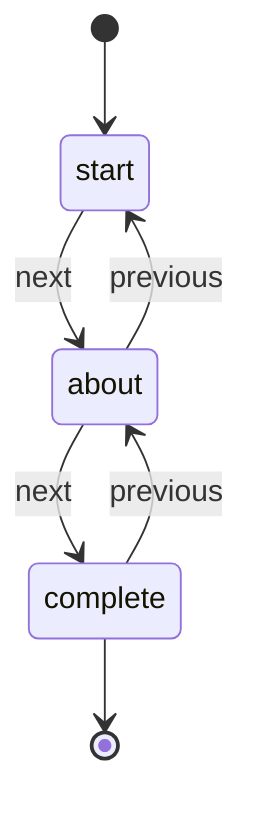
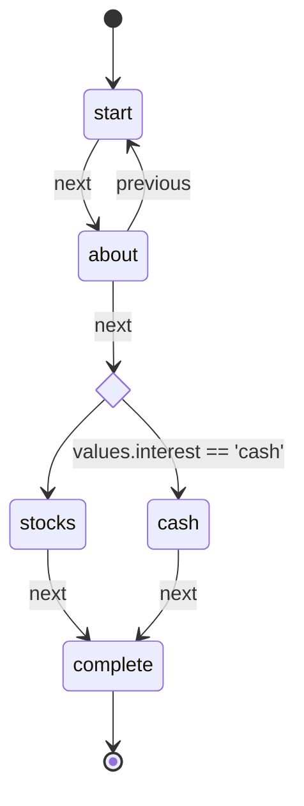

# Becoming a Form Wizard

Intuitive Multi-Step Workflows w/ State Machines

<!--
TODO:
- rebuild robo-wizard site in something like docusaurus for revamped release
- figure out official react bindings for full FlowStateProvider replacement
-->

---
layout: cover
---

# The bit about me

- Nick Hehr
- Staff Software Engineer, Front End Platform Team
- Empathetic Community Organizer
- Amateur Embedded Developer
- Outdoor cyclist, Indoor climber

---
layout: table-contents
---

# Our journey

- What is a wizard?
- How are they typically created?
- Where do state machines come in?
- What can we use today?
- What lies ahead?

---
layout: new-section
sectionImage: "/ms_wizard_setup.png"
---

# What is a wizard?

<!--
Requesting user input to create records or perform actions is not always as simple as a form on a single page. Many user experiences require customers to click through multiple steps to submit all the information needed to complete a complex task.
-->

<!--
This UI pattern is often called a “wizard”, a term dating back to the late 80s and early 90s, to indicate “step-by-step guides that are designed to walk you through complex tasks.” A popular source of this phraseology is Microsoft Publisher’s Page Wizard feature and the Connection Wizard.
-->

---
layout: iframe
url: "https://giphy.com/embed/Cu0Iqwal4cPyU"
---

<!-- Looking for someone to share in an adventure -->

<!--
While this brings the Lord of the Rings and Gandalf the Grey to mind, others might picture the Microsoft Windows Connection Wizard or Turbo Tax for a modern take.
-->


---


<!-- gif or screenshots of user onboarding / TurboTax -->

<!--
Many services and apps will break up their registration process into a series of steps to ease that process, especially if there is quite a bit of information to gather in order to get started. Filling out long forms can be incredibly tedious, so wizards provide an experience where people can focus on individual pieces of those long forms with a sense of accomplishment with each step forward. Based on choices made through the process, the wizard can even help people skip irrelevant paths and potential confusion. I think we've all seen those sections on tax forms that have a bunch of fine-print conditionals that eventually lead to ignoring it altogether. 
-->

---
layout: image-left
image: "/long_form_example.png"
---

## What we don't want

<---

---
layout: full
---


<!-- Go with the flow, my dude -->

<!--
At Betterment, we call this pattern a "flow" (or workflow) and use it a lot! As a financial services company, there's a lot of information and complex concepts to cover, and we want to ensure our clients understand these decisions. Along with the usual sign up task, we've formalized creating goals, moving money, connecting external accounts, and more as flows. Given how many we've had to build and maintain, it makes sense to have some common conventions and utilities for teams to use.
-->

---
layout: new-section
sectionImage: "/hammer-and-wrench.png"
---

# How are these experiences typically built?

---
layout: image
image: "/react-multi-step-form-DuckDuckGo.png"
---

<!--
If you've ever had to tackle this pattern in the past, you might have searched for "multi-step forms" or "form wizard for X" where X is the framework of choice for your product. I know I definitely looked around for such a solution when starting this journey at Betterment. 
-->

---
layout: image
image: "/formik-og.png"
---

<!--
Naturally, I looked to the docs and examples for Formik (the form state manager of choice at Betterment).
-->


---
src: ./formik-multi-step-code.md
---

<!--
Looking to the Formik repo (the form state manager of choice at Betterment), we can see an example for a [`MultipstepWizard`](https://github.com/jaredpalmer/formik/blob/master/examples/MultistepWizard.js) that creates an abstract `Wizard` component with `WizardStep` child components. This allows for nice composition while splitting up a large form, and it could be reused across features as long as they use the same layout. One notable downside is the lack of routing, so the current step of the flow is lost if the page is reloaded.
-->

---
src: ./routed-multi-step-code-1.md
---

<!--
In the same repo, we can find two examples of routed multi step forms, one using [numbered steps](https://github.com/jaredpalmer/formik/blob/master/examples/RoutedMultistepWizard.js) and the other using [named steps](https://github.com/jaredpalmer/formik/blob/master/examples/RoutedMultistepWizard2.js). The numbered steps provides a similar composition benefit as the first example, although numbers are not too helpful as path names to communicate the intent of the step. With the named steps, the ability to customize validation and form submission per step is lost. 
-->

---
src: ./routed-multi-step-code-2.md
---

<!--
The greatest weakness of each of the examples is how tied they are to Formik, which ultimately makes sense as example for this library. However, many approaches found online will promote similar patterns especially with route-less steps. They are all generally focused on moving sequentially, a.k.a linear progression. It's not easy to see how conditionally paths could be integrated.

Looking at the purpose-built libraries, nothing appeared to solve all the concerns of building flows at Betterment. So that's when I set out to solve it myself.
-->

---

## Primary Directives

1. Flows will be routed, meaning visible steps should match a path in the URL
2. Navigation among steps should have a single source of truth
3. Flows are form-agnostic, however they can integrate cleanly with Formik as the preferred form library

<!--
To direct the work towards building this new solution, I came up with 3 primary directives. The first maintains the stance that good web experiences have URLs and aligned with the existing Rails-driven flows. The second was a learning from the Rails-driven flows that made it complex to maintain our flows. The last one came from looking at our needs at Betterment and how wizards may gather information but it is not required.
-->

---
layout: cover-logos
logos: [
  "/reactjs.svg",
  "/react-router.png"
]
---

## Ingredients

- React Context
- react-router Route components
- Reducer function
- custom hook

<!-- 
What is the naive core of FlowStateProvider, before state machine refactor? react-router Route components, React Context, useReducer, custom hook
-->

---

## React Context

```tsx
export interface FlowState<Values> {
  values?: Values;
  basePath?: string;
  currentStep?: string;
  steps?: Readonly<string[]>;
}

type Action<Values> =
  | {
      type: 'sync';
      step: string;
    }
  | {
      type: 'updateValues';
      values: Partial<Values>;
    };

type FlowContextValue = [FlowState<any>, Dispatch<Action<any>>];

const FlowContext = createContext<FlowContextValue | undefined>(undefined);
```

<!--
While TypeScript is not required, I'm displaying the types to help inform the expected inputs to the React Context shared by the flow consumers
-->

---

## react-router Route components as steps

```tsx
function Step<Values>({ children, component: Component, name }) {
  const { history, location, match } = useContext(RouterContext);
  const state = useFlowState<Values>();
  const stepProps: StepProps<Values> = {
    history,
    location,
    match,
    ...state
  };
  const child = Component ? <Component {...stepProps} /> : children(stepProps);

  return <Route path={name} render={() => child} />;
}
```

<!--
The Step component ends up being a very light layer over the Route component, providing access to the shared flow context through the `useFlowState` hook, which we'll cover shortly. The usage should be familiar to anyone who has used react-router in the past. We can see the common "Values" generic being referenced to allow for strong typing around the "Values" being gathered by the flow.
-->

---

## Reducer function

```tsx
function buildReducer<Values>(): Reducer<FlowState<Values>, Action<Values>> {
  return (state, action) => {
    switch (action.type) {
      case 'sync':
        return {...state, currentStep: action.step };
      case 'updateValues':
        return {
          ...state,
          values: {
            ...state.values,
            ...action.values,
          },
        };
      default:
        return state;
    }
  };
}
```

<!--
We can see the FlowState and Action types being used here to define the state and actions accepted by the reducer. The `sync` action is used to keep the current step in sync with the URL. And the `updateValues` action is fairly straightforward, merging the current values in state with new ones provided bythe action. 

It all comes together in the custom hook.
-->

---

## Custom hook: `useFlowState`

```tsx
function useFlowState<Values>() {
  const context = useContext(FlowContext);
  const history = useHistory();
  const [flowState, dispatch] = context;

  const sync = useCallback(
    (step) => {
      dispatch({ type: 'sync', step });
    },
    [dispatch]
  );

  const updateValues = useCallback(
    (values>) => {
      dispatch({ type: 'updateValues', values });
    },
    [dispatch]
  );

  const goToStep = useCallback(
    (
      step,
      values,
    ) => {
      if (values) {
        updateValues(values);
      }
      history.push(step);
    },
    [flowState.steps, history, updateValues]
  );

  const goToNextStep = useCallback(
    (values) => {
      const nextStep = getNextStep(flowState.steps, flowState.currentStep);
      if (nextStep) {
        goToStep(nextStep, values);
      }
    },
    [flowState.steps, flowState.currentStep, goToStep]
  );

  const goToPreviousStep = useCallback(() => {
    const previousStep = getPreviousStep(
      flowState.steps,
      flowState.currentStep
    );
    if (previousStep) {
      goToStep(previousStep);
    }
  }, [flowState.steps, flowState.currentStep, goToStep]);

  return {
    flowState,
    sync,
    updateValues,
    goToStep,
    goToNextStep,
    goToPreviousStep
  };
}'
```

<style>
.slidev-layout {
    overflow: scroll;
  }
</style>

---

## Bring it together

```tsx
function FlowStateProvider<Values>({ children, initialValues }) {
  const location = useLocation();
  const [steps] = useState(() =>
    React.Children.toArray(children).reduce(
      (result, child) => {
        if (child?.type === Step) {
          result.push(element.props.name);
        }
        return result;
      },
      []
    )
  );
  const currentStep = getStepNameFromPath(location.pathname);
  const defaultStep = steps[0];
  const value = useReducer(buildReducer<Values>(), {
    currentStep,
    values: initialValues,
    steps
  });

  return (
    <FlowContext.Provider value={value}>
      {children}
    </FlowContext.Provider>
  );
}
```

<style>
.slidev-layout {
    overflow: scroll;
  }
</style>

---

## Usage

```tsx
 <FlowStateProvider>
   <Step name="first" component={MyFirstStep} />
   <Step name="second" component={MySecondStep} />
   <Step name="third" component={MyThirdStep} />
 </FlowStateProvider>
```

<!--
So the actual first iteration of what came to be the `FlowStateProvider` pattern didn't use state machines at all, so it only really solved 2 out of the 3 core concerns: routing and composition without being tied to a form library. It made use of React's Context API, a simple reducer function, and React Router Route components.
-->

---
layout: full
---

# Usage

```tsx
const MyFirstStep = ({ goToNextStep }) => {
  return (
    <Formik onSubmit={goToNextStep}>
      <Form>
        <label id="name-label" htmlFor="name">Name</label>
        <Field type="text" name="name" id="name" aria-labelledby="name-label" />
        <button type="submit">Continue</button>
      </Form>
    </Formik>
  )
};
```

```tsx
const MySecondStep = ({ flowState }) => {
  const { name } = flowState.values;
  return (
    <section>
      <h1>Hello, {name}!</h1>
      {/* maybe another form here */}
    </section>
  )
}
```

<!--
Steps could use Formik, any other form library, or nothing at all if no form was needed, they just needed to call `goToNextStep` from the StepProps or the `useFlowState` hook:

`goToNextStep` will capture the form values and store it as `flowState.values`, making it clear that Formik manages the form state while the `FlowStateProvider` managed the flow state (as the name implies :D).

This abstraction worked pretty well for a while until the first need for conditional progression sprung up.
-->

---
layout: full
---

## Form agnostic

```tsx
const MyFirstStep = ({ goToNextStep }) => {
  function handleSubmit (event) {
    event.preventDefault();
    const data = new FormData(event.target);
    const values = Array.from(data.entries()).reduce((result, [name, value]) => {
      return { ...result, [name]: value };
    }, {});
    goToNextStep(values)
  }
  return (
    <form onSubmit={handleSubmit}>
      <label id="name-label" htmlFor="name">Name</label>
      <input type="text" id="name" name="name" aria-labelledby="name-label" />
      <button type="submit">Continue</button>
    </form>
  )
}
```
---

## Only one way through

```tsx
 <FlowStateProvider>
   <Step name="first" component={MyFirstStep} />
   <Step name="second" component={MySecondStep} />
   <Step name="third" component={MyThirdStep} />
 </FlowStateProvider>
```

<!--
While this solution appears to cover the intended usage, we're still stuck with linear progression with no obvious way "forward" ;) What happens when displaying a Step (or set of Steps) is dependent on a choice made in an earlier Step?
-->

---
layout: new-section
---

# How do state machines help solve this problem?

<!-- also what the heck is a state machine? -->

---
layout: quote
---

> an abstract machine that can be in exactly one of a finite number of states at any given time. The FSM can change from one state to another in response to some external inputs; the change from one state to another is called a transition. An FSM is defined by a list of its states, its initial state, and the conditions for each transition.

["Finite-state machine" page on Wikipedia](https://en.wikipedia.org/wiki/Finite-state_machine)

<!--
For folks unfamiliar with state machines (formally known finite-state automata), they provide a mathematical model of computation that describes the behavior of a system that can be in only one state at any given time and the ability to transition between these states determined by specified events.

To relate this back to flows, those are user experiences that can only display one step at a time with specific actions that lead to progressing between them.
-->

---

> an ~~abstract machine~~ **interactive experience** that can ~~be in~~ display exactly one of a finite number of ~~states~~ **steps** at any given time. The ~~FSM~~ flow can change from one ~~state~~ step to another in response to some external inputs; the change from one ~~state~~ to another is called a ~~transition~~ **navigation**. ~~An FSM~~ A flow is defined by a list of its ~~states~~ steps, its initial ~~state~~ step, and the conditions for each ~~transition~~ navigation.

<!--
To relate this back to flows, those are user experiences that can only display one step at a time with specific actions that lead to progressing between them.
-->

---
layout: section
---

## How typical multi-step flows navigate



<!--
Rather than keeping the current step of the flow within the flow state and incrementing/decrementing based on the next/previous actions, it was more deterministic to model each step as a finite state to drive the flow based on next/previous events.
-->

---
layout: center
---

## How we want to be control the conditional navigation

---
layout: center
---



<style>
.slidev-layout {
    overflow: scroll;
  }
</style>

<!--
  From there, it became clear how to provide conditional logic based on [transitions guards](https://xstate.js.org/docs/guides/guards.html#guards-condition-functions):
-->

---
layout: iframe
url: "https://giphy.com/embed/njYrp176NQsHS"
---

<!-- You shall not pass -->

---
layout: center
---

```tsx
const MyFlowController = () => {
  const values = {
    name: '',
    email: '',
    interest: '',
  };
  const isInterestedInCash = (currentValues, nextState) => nextState.values.interest === 'cash';

  return (
    <FlowStateProvider initialValues={values}>
      <Step name="start" component={StartStep} />
      <Step name="about" component={AboutStep} next={[['cash', when(isInterestedInCash)], 'stocks']} />
      <Step name="stocks" component={StocksStep} next="complete" />
      <Step name="cash" component={CashStep} previous="about" />
      <Step name="complete" component={CompleteStep} />
    </FlowStateProvider>
  )
}
```

---
layout: iframe
url: https://www.youtube.com/embed/NXedb2z7N-4?start=284
---

<!-- Cassidy Williams covers a similar concept using the framing of "choose your own adventure": https://youtu.be/NXedb2z7N-4 -->

---
layout: new-section
---

# What can we use today?

<!-- Introducing robo-wizard, sort of publicly for the first time -->

---

<!--
`FlowStateProvider` and its associated components / hooks isn't currently open source, although I am allowed to openly talk about them. Instead, I've worked on taking the core idea and creating a framework-agnostic library built on top of xstate called `robo-wizard`.
-->

---
layout: iframe
url: https://robo-wizard.js.org/
---

---
layout: iframe
url: https://thisrobot.life
---

<!-- Shoutout to [robot](thisrobot.life) for introducing the idea of state machines built through functional composition. -->

---

<!--
`robo-wizard` abstracts the core idea of building flow logic as a domain-specific language (DSL) for state machines. Building it on `xstate` means it _should_ be able to take advantage of the existing framework integrations, debugging, and planning tools.
-->

---
layout: center
---

# Demo breaking down a W4 (or similar government doc) as a robo-wizard powered feature.

---
layout: new-section
---

# Where do we go from here?

<!-- A wizard's journey is never truly complete --> 

---
layout: iframe
url: "https://giphy.com/embed/10es4gkhzGC6zu"
---

<!-- end? No, the journey doesn't end here -->

---
layout: iframe
url: "https://giphy.com/embed/MeMG8qZuni8XS"
---

<!-- all you have to decide is what to do with the time that is given to you -->

---
layout: fact
---

###  How do we communicate about flows better?

Visualize flow behavior and iterate with a shared language that Product, Design, and Engineering can all understand.

---
layout: fact
---

### What concerns are we missing for the patterns demonstrated above?
- Entry and exit steps
- Final steps
- sub flows (nested services) for efficient reuse
- other side effects that are of concern

---
layout: center
---

# Thank you!

---
layout: iframe
url: "https://giphy.com/embed/oM5xTkZM5N1ZK"
---

<!-- Gandalf SMH -->

---
layout: iframe
url: "https://giphy.com/embed/FPjbHO0jJxGsE"
---

<!-- I have no memory of this place -->
